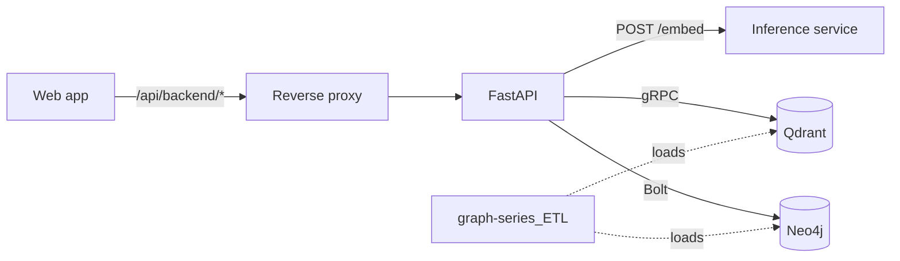
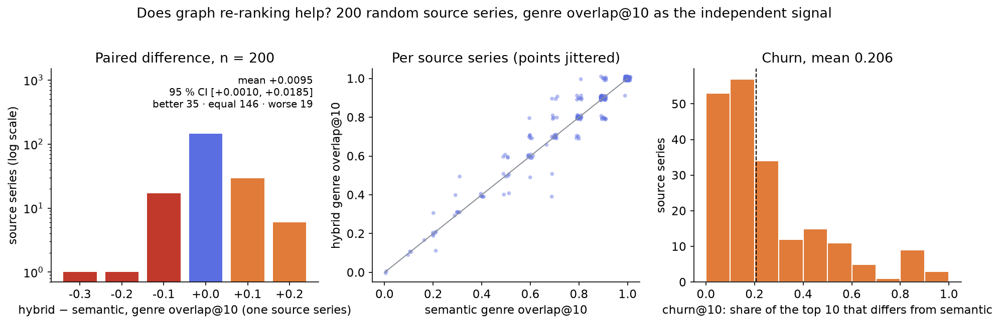
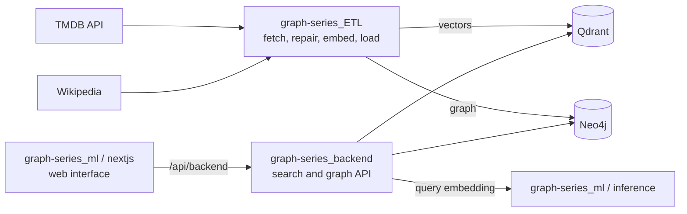

# Graph Series Backend

The API behind **Graph Series**: it searches about 56,000 TV series by meaning, title or person and serves their knowledge graph (cast, creators, genres, keywords, networks, countries, languages). It combines two stores, a graph in **Neo4j** and sentence embeddings in **Qdrant**, keyed by the same TMDB id.

Live: the deployment is reached through the web app's same-origin path, for example <https://graph-series.katzer.ru/api/backend/health> (read-only `GET`s only; see [Usage examples](#usage-examples)).

```bash
curl -s 'https://graph-series.katzer.ru/api/backend/api/search?q=space%20western&mode=semantic&limit=3'
```
```json
{ "query": "space western", "mode": "semantic",
  "results": [ { "tmdb_id": 30991, "name": "Cowboy Bebop", "start_year": 1998, "score": 0.7173728942871094, "source": "vector", … },
               { "tmdb_id": 82856, "name": "The Mandalorian", "score": 0.7039527893066406, … },
               { "tmdb_id": 5172, "name": "BraveStarr", "score": 0.7023429870605469, … } ],
  "total": 3 }
```

*Real response from the public deployment on 2026-10-04, trimmed ([full file](docs/examples/search-semantic.json)).*

> This product uses the TMDB API but is not endorsed or certified by TMDB.

## What this project demonstrates

- **Four ways to search one catalogue.** `semantic` (query embedding against a vector index), `structural` (full-text on titles), `hybrid` (semantic candidates re-ranked by shared cast and country) and person search, plus similar series and graph navigation; 15 `GET` endpoints in total ([API reference](docs/api.md)).
- **Re-ranking that was measured, not assumed.** Graph re-ranking raises genre overlap@10 from 0.764 to 0.774 on 200 random series: +0.0095, 95 % bootstrap interval [+0.0010, +0.0185], with 35 series better, 146 unchanged and 19 worse. A zero-weight control reproduces the plain semantic ranking exactly ([evaluation](docs/evaluation.md)).
- **Graph queries that stay small.** Pattern comprehensions instead of `OPTIONAL MATCH` chains (which multiply cast × keywords × … into hundreds of thousands of rows), and top-N selection for hubs with tens of thousands of series done inside Neo4j ([design decisions](docs/design-decisions.md)).
- **Safe query construction.** Values reach Cypher only as parameters, labels come from constant dictionaries, and user text for the full-text index is escaped; an unescaped bracket used to turn a search into an HTTP 500.
- **Tested without databases.** 43 unit tests with the stores faked, 84 % line coverage measured, and `ruff`, `mypy` and `pytest` all pass in a clean environment ([tests](#tests-and-quality)).
- **Honest operations notes.** A real incident (the full-text indexes were missing after a graph reload, so two search modes returned 500) is described with its cause and fix ([Limitations](#limitations)).

## Contents

[Idea](#idea) · [Features](#features) · [How it works](#how-it-works) · [Results and evaluation](#results-and-evaluation) · [Quick start](#quick-start) · [Usage examples](#usage-examples) · [Configuration](#configuration) · [API reference](#api-reference) · [Repository layout](#repository-layout) · [Tests and quality](#tests-and-quality) · [Deployment](#deployment) · [Limitations](#limitations) · [Related repositories](#related-repositories) · [License and attribution](#license-and-attribution)

## Idea

A single database is a poor fit for this catalogue. A graph answers "who acted in both of these" and "which series share a keyword" exactly, but cannot say what a show *feels* like; embeddings capture mood and theme, but know nothing about cast. The backend puts both behind one API:

1. **Vector search** over embeddings of each series' title, overview and keywords gives candidates by meaning.
2. **The graph** supplies explicit relationships: for ranking (shared actors and countries), for completion (similar series when the vector index has few neighbours) and for navigation (neighbourhoods of series, people and hub nodes such as a genre).

The key of a series is its TMDB id everywhere (the Qdrant point id, the Neo4j node key), so a vector hit is a graph node without a lookup table. The vector index is wider than the graph (about 211,000 against about 56,000), so every search result is filtered to series that exist in the graph, which makes each result navigable.

## Features

Complete reference with parameters and real responses: [`docs/api.md`](docs/api.md).

| Group | Endpoint | What it does |
|---|---|---|
| Search | `GET /api/search` | `mode=semantic` (default), `structural`, `hybrid`; `limit`, `score_threshold`, `actor_boost`, `country_boost` |
| | `GET /api/search/stream` | the semantic search as Server-Sent Events, one result at a time |
| | `GET /api/search/persons` | full-text person search with series counts |
| Series | `GET /api/series/{tmdb_id}` | the full card: ids, years, status, counts, ratings, text, genres, keywords, countries, languages, networks, creators, directors |
| | `GET /api/series?name=` | full-text autocomplete by title |
| | `GET /api/series/{tmdb_id}/similar` | similar series: vector neighbours of the series itself, optionally re-ranked by the graph, topped up from the graph when fewer than 10 exist |
| Persons | `GET /api/person/{id}` | the person and their series by role |
| | `GET /api/person/{id}/graph` | series and up to 5 co-workers per series as a graph |
| | `GET /api/graph/person/{id}/series` | the person's series, newest first |
| Graph | `GET /api/graph/series/{tmdb_id}` | neighbourhood graph, `depth` 1 or 2, `include_types` filter |
| | `GET /api/graph/node/{type}/{key}` | hub graph for a genre, keyword, network, country or language: the hub and its most popular series |
| | `GET /api/graph/series/{id}/shared-cast` | other series by number of shared actors |
| | `GET /api/graph/intersection` | people who took part in two given series |
| Health | `GET /health`, `GET /health/full` | liveness; connectivity of Neo4j and Qdrant and the state of the two full-text indexes (both must be `ONLINE`) |

Search modes in short:

| Mode | How it works |
|---|---|
| `semantic` | the query is embedded (BGE-small with the retrieval-query instruction, by a separate service) and matched against the vector index |
| `structural` | full-text search over titles and original titles in Neo4j; user input is escaped for Lucene syntax and turned into a prefix query; an exact title match comes first, then the full-text score, then popularity |
| `hybrid` | semantic candidates re-ranked by the graph: a bonus for shared cast (capped at five actors) and for shared production country with the top result; each result reports its `shared_actors` and `shared_countries` |

## How it works



A hybrid search: the query is embedded by the inference service; Qdrant returns three times the requested number of neighbours; those not present in the graph are dropped; the first remaining one becomes the **anchor**; the others get a bonus for sharing actors and countries with it; the top results are enriched with card data from Neo4j in one batch query. Sequence diagrams for all flows, the data model and the schema: [`docs/architecture.md`](docs/architecture.md).

**Key design decisions** (reasons, alternatives, what was dropped: [`docs/design-decisions.md`](docs/design-decisions.md)):

- **Embeddings come from a separate service**, because the 4 GB API server cannot also hold a model next to Neo4j.
- **Over-fetch from Qdrant, then filter to the graph**, because the graph is a subset of the vector index.
- **Hybrid ranking uses an anchor and two capped bonuses**; the weights are hand-chosen and their effect is measured.
- **Pattern comprehensions and in-database top-N**, so a card or a hub graph never unfolds into a huge row set.
- **Parameters, whitelists and escaping** for every query.
- **`label:key` node ids**, because TMDB keys of different entity types collide.
- **`qdrant-client` pinned to the server version** (1.9.2): a newer client sends vectors the server reads as empty.

## Results and evaluation

Does graph re-ranking help? Measured by [`fastapi/scripts/eval_hybrid.py`](fastapi/scripts/eval_hybrid.py) on 200 random source series, scoring each top 10 by **genre overlap@10**: the share of results that have at least one genre in common with the source. Genre is not part of the re-ranking formula, so it is an independent signal. The three rankings use the same candidates and the production function `_hybrid_rerank`.

| Ranking | genre overlap@10 |
|---|---|
| semantic | 0.764 |
| hybrid (production weights `actor_boost` 0.05, `country_boost` 0.1) | 0.774 |
| hybrid with zero weights | 0.764 |



*Left: hybrid minus semantic per source series (log scale). Middle: semantic against hybrid per series, jittered. Right: churn@10, the share of the top 10 that differs from the semantic list. Drawn from the committed `report_hybrid.csv` (n = 200) by `docs/figures/make_figures.py`.*

The difference is **+0.0095** (95 % paired bootstrap interval +0.0010 to +0.0185, 5,000 resamples, seed 42): statistically distinguishable from zero, about +1.2 % relative, and bought by changing on average 0.206 of the top 10 (churn@10); it is better for 35 series, equal for 146 and worse for 19, the worst falling from 0.7 to 0.4. The zero-weight control matches the semantic ranking in all 200 rows, so the gain comes from the weights, not from the re-ranking pass. Method, caveats and what is not covered (the weights are hand-chosen, the graph fill-in weights of `/similar` and `/search?mode=hybrid` are not evaluated, genre overlap is a proxy): [`docs/evaluation.md`](docs/evaluation.md). The numbers were recomputed from the committed CSV; the evaluation itself needs live databases and was not rerun here.

## Quick start

Requirements: Python 3.12. The API needs a running Neo4j with the data loaded, a Qdrant collection and the embedding service; **the unit tests need none of them.**

**A. Run the checks and the tests (no databases).** Verified in a clean environment on 2026-10-04:

```bash
git clone https://github.com/GKatzer/graph-series_backend.git
cd graph-series_backend/fastapi
uv venv --python 3.12 .venv && uv pip install --python .venv/bin/python -r requirements.txt ruff mypy pytest pytest-asyncio
export NEO4J_PASSWORD=ci QDRANT_HOST=localhost
.venv/bin/ruff check app/          # All checks passed!
.venv/bin/mypy app/ --ignore-missing-imports   # Success: no issues found in 17 source files
.venv/bin/pytest tests/ -q         # 43 passed, 1 warning in 1.40s
```

**B. Try the API without installing anything.** The public deployment answers read-only requests (see [Usage examples](#usage-examples)).

**C. Run the API yourself** (not run in this environment: it needs Neo4j, Qdrant and the embedding service):

```bash
cp .env.example .env                     # fill in the values, see Configuration
docker compose up -d neo4j               # wait for the health check
docker compose exec -T neo4j sh -c 'cypher-shell -u neo4j -p "${NEO4J_AUTH#neo4j/}"' < scripts/schema_init.cypher
# load the data with graph-series_ETL (qdrant_loader.py, neo4j_loader.py), then:
docker compose up -d fastapi
curl http://localhost:8000/health
```

Where the data and the embedding service come from, and the order of the steps: [`docs/deployment.md`](docs/deployment.md). Apply `scripts/schema_init.cypher` after **every** full reload of the graph, or the full-text endpoints answer HTTP 500.

## Usage examples

Real responses from the public deployment, 2026-10-04 (read-only `GET`; trimmed; the full set is in [`docs/examples/`](docs/examples/) and regenerated by `docs/examples/fetch_samples.py`):

```bash
B=https://graph-series.katzer.ru/api/backend

curl -s $B/health/full
# {"status":"ok","neo4j":"up","qdrant":"up"}

curl -s "$B/api/graph/series/1396?depth=1&include_types=HAS_GENRE,PRODUCED_IN"
# nodes: series:1396 (Breaking Bad), genre:80 (Crime), genre:18 (Drama), country:US
# edges: HAS_GENRE ×2, PRODUCED_IN ×1

curl -s "$B/api/graph/node/genre/18?limit=3"
# hub genre:18 "Drama" with properties.total = 23928, plus its 3 most popular series

curl -s "$B/api/graph/series/1396/shared-cast?limit=3"
# {"source":1396,"results":[{"tmdb_id":60059,"name":"Better Call Saul","start_year":2015,"shared_actors":5},
#                           {"tmdb_id":90746,"name":"Better Call Saul Employee Training", …,"shared_actors":3}, …]}

curl -s "$B/api/search/stream?q=space%20western&limit=2"
# data: {"type": "meta", "total": 2}
# data: {"type": "result", "data": {"tmdb_id": 30991, "name": "Cowboy Bebop", …}}
# data: {"type": "result", "data": {"tmdb_id": 82856, "name": "The Mandalorian", …}}
# data: {"type": "done", "total": 2}

curl -s "$B/api/series/99999999"
# {"detail":"Series 99999999 not found"}                       (HTTP 404)
```

A depth-1 graph of one series (Breaking Bad) has 66 nodes and 67 edges: 29 persons, 29 keywords, 2 genres, 3 languages, 1 network, 1 country and the series; edges 20 `ACTED_IN`, 10 `DIRECTED`, 1 `CREATED`, 29 `HAS_KEYWORD`, 2 `HAS_GENRE`, 3 `HAS_LANGUAGE`, 1 `AIRED_ON`, 1 `PRODUCED_IN` ([counts](docs/examples/graph-series-1396-depth1.counts.json)).

## Configuration

Set in `.env` (not committed; template `.env.example`) or in the compose `environment` block. Checked against `fastapi/app/config.py` and `fastapi/app/services/embedder.py` with `grep`.

| Variable | Meaning | Default | Required |
|---|---|---|---|
| `NEO4J_PASSWORD` | Neo4j password (also used by compose to start Neo4j) | none | **yes** |
| `NEO4J_USER` | Neo4j user | `neo4j` | no |
| `NEO4J_URI` | Bolt address | `bolt://neo4j:7687` | no (compose sets it) |
| `QDRANT_HOST` | Qdrant host; compose fills it from `QDRANT_TAILSCALE_HOST` | none | **yes** |
| `QDRANT_GRPC_PORT` | Qdrant gRPC port | `6334` | no |
| `QDRANT_PORT`, `QDRANT_PREFER_GRPC` | REST port (unused, needed by the client constructor), use gRPC | `6333`, `true` | no |
| `QDRANT_COLLECTION` | collection name | `graph-series` | no |
| `EMBED_SERVICE_URL` | the embedding service's `/embed` URL | `http://host.docker.internal:8004/embed` | in practice yes |
| `CORS_ORIGINS_RAW` | allowed origins, comma separated | the project's own origins and `http://localhost:3000` | set it for your site |
| `APP_ENV` | `production` hides `/docs` | `production` | no |
| `API_SECRET_KEY` | declared in settings, not used by any code | empty | no |
| `PRIVATE_BIND_IP` | compose only: address of the host on the private network, on which Neo4j (7687) and the API (8000) are published | none | **yes** for compose |

## API reference

Fifteen `GET` endpoints, listed under [Features](#features). Parameters, defaults, response fields, error cases, the hybrid formula, the `/similar` algorithm and real responses: [`docs/api.md`](docs/api.md). The interactive OpenAPI page (`/docs`) is disabled in production.

## Repository layout

```
graph-series_backend/
├── fastapi/
│   ├── app/
│   │   ├── main.py             app, CORS, lifespan (connectivity checks), routers under /api
│   │   ├── config.py           settings from .env / environment
│   │   ├── schemas.py          GraphNode / GraphEdge / GraphData, node_id(), key property per label
│   │   ├── db/                 neo4j.py (async driver), qdrant.py (client in a thread pool)
│   │   ├── services/           embedder.py, enricher.py (batch cards, keep_in_graph), lucene.py (escaping)
│   │   ├── routers/            health, search (+ similar), series, person, graph
│   │   └── log_config.json     uvicorn and app logging
│   ├── tests/                  43 unit tests with faked databases
│   ├── scripts/eval_hybrid.py  evaluation of the hybrid re-ranking on live Neo4j + Qdrant
│   ├── Dockerfile, requirements.txt, pyproject.toml
├── scripts/                    schema_init.cypher, deploy.sh, backup_neo4j.sh, tvkg-vds1.service
├── neo4j/conf/neo4j.conf       memory and logging settings (the APOC plugin is downloaded by the image)
├── docker-compose.yml          Neo4j + FastAPI (private address from PRIVATE_BIND_IP)
├── .github/workflows/ci-vds1.yml   lint, type check, tests, then deploy on a self-hosted runner
├── report_hybrid.csv           per-series results of the evaluation (200 rows)
├── docs/                       api.md, architecture.md, design-decisions.md, evaluation.md, deployment.md,
│                               examples/ (real responses, fetch script), figures/make_figures.py, media/
├── .env.example
└── LICENSE
```

## Tests and quality

```text
$ pytest tests/ -q
43 passed, 1 warning in 1.40s
```

| File | Tests | What it covers |
|---|---|---|
| `tests/test_tmdb_schema.py` | 15 | response contracts of series, graph, hub, person, search and similar endpoints against a fake Neo4j: integer ids, 404, id namespacing (`series:…`, `person:…`), skipping unrequested edge types, ignoring unknown `include_types`, hub errors (400, 422), country keys as strings, dropping series missing from the graph and the over-fetch, the hybrid anchor, `/similar` retrieving by `tmdb_id` |
| `tests/test_lucene.py` | 11 | escaping of every special Lucene character (parametrised), and that structural search, person search and the autocomplete escape their query and skip Neo4j for a whitespace-only query |
| `tests/test_behaviour.py` | 13 | the behaviour added on 2026-10-04: `shared_actors` / `shared_countries` in hybrid search and `/similar` (and `null` for the anchor), the hybrid score including the bonus, structural results marked `source: "graph"`, exact-match-first ordering for titles and persons, English hub errors, HTTP 503 when the embedding service is down (also an `error` event on the SSE stream, and the embedder wrapping any failure), `/health/full` for healthy, missing and `POPULATING` full-text indexes and for a Qdrant failure |
| `tests/test_health.py` | 4 | `/health`, a missing series, and the validation of `q` (required, minimum length) |

Mutation check: removing the `shared=` argument from the hybrid call in `/search` makes one of the new tests fail; restoring it makes the suite pass again.

Measured with `pytest-cov` (used once, not part of the requirements): **84 % line coverage** of `app/` (645 statements, 105 missed). Least covered: `services/embedder.py`, `db/qdrant.py`, `routers/graph.py` (depth 2, `shared-cast`, `intersection`, `person/{id}/series`) and the SSE happy path of `routers/search.py`.

Not tested: any real database or the inference service (everything is faked, so **the new Cypher ordering clauses were not executed against Neo4j**), the SSE success path, the graph fill-in beyond the call it makes, and performance. The evaluation script is not run by the tests.

**CI.** `.github/workflows/ci-vds1.yml` runs `ruff`, `mypy` and `pytest` on pushes and pull requests to `master` that touch `fastapi/`, then deploys through a self-hosted runner. The three steps pass locally; **the workflow has not been observed running on GitHub**, so there is no CI badge.

## Deployment

Two servers on a private network: the API server runs this repository's compose file (Neo4j and FastAPI) behind a reverse proxy; the web server runs Qdrant, the embedding service and the web app. Setup steps, loading the data, the CI and release script, backups, resource estimates and the inconsistencies found in the deployment files: [`docs/deployment.md`](docs/deployment.md). The deployment steps were not run in this environment.

## Limitations

- **Incident, 2026-10-04.** `structural` search, person search and `/api/series?name=` answered HTTP 500 on the public deployment because the Neo4j full-text indexes `series_name_idx` and `person_name_idx` did not exist: they are created only by `scripts/schema_init.cypher`, which has to be re-run after every graph reload (the ETL loader does not create them). The owner re-ran the script the same day; the first request right after creation still failed while the indexes were `POPULATING`, later ones answered 200. The code now reports this: `/health/full` answers 503 while either index is missing or not `ONLINE`.
- **Changes not yet deployed or measured.** On the same day the code was changed to fill `shared_actors` / `shared_countries`, mark structural results as `source: "graph"`, put exact title matches first, return 503 when the embedding service is down, and report English hub errors. They are covered by unit tests with faked databases only; the new `ORDER BY` clauses in the Cypher queries were **not run against a real Neo4j**, and the example responses in `docs/examples/` were captured from the deployment **before** these changes (they still show `null` counts and `source: "vector"`).
- **Structural ranking was weak before that change.** Prefix queries get an almost constant full-text score (for `breaking` three series scored 2.0 and *Breaking Bad* came third); the exact-match-first ordering addresses titles, the rest still depends on that score and on popularity.
- **Hybrid scores can exceed 1.** Hybrid in `/search` uses the first hit as its anchor, so a poor first hit drags the ranking; searching by a title does not return that title first in `semantic` or `hybrid` mode (for `breaking bad` the remake *Metástasis* came first).
- **The re-ranking gain is small** (+0.0095 genre overlap@10), the weights were not tuned, and `/similar`'s graph fill-in weights and the `/search` hybrid are not evaluated ([evaluation](docs/evaluation.md)).
- **Depth-2 graphs type every shared-person edge as `ACTED_IN`** even when the person created or directed the other series.
- **Latency varies**: most calls took 1.3 to 4 s on 2026-10-04, `shared-cast` took 12.5 s and `intersection` 7.3 s in one try each (single requests, not a benchmark).
- **Operations:** `API_SECRET_KEY` is unused, a backup stops Neo4j for its duration, no reverse-proxy configuration is in the repository, and no CI run on GitHub has been seen ([list](docs/deployment.md#known-inconsistencies-in-the-deployment-files)).
- **Data coverage** comes from TMDB: uneven (about half the shows have cast, under a third keywords); the graph holds only series with at least two votes; the index is a snapshot.

## Related repositories

**Graph Series** is a search and exploration system for about 56,000 TV series. It is built from three repositories that form one pipeline: a data pipeline fills a vector index and a graph database, an API combines the two stores, and a web interface (with the query-embedding service) sits on top.



| Repository | Role |
|---|---|
| [`graph-series_ETL`](https://github.com/GKatzer/graph-series_ETL) | data pipeline: TMDB fetching, Wikipedia fallback for thin descriptions, embeddings, loading of Qdrant and Neo4j, retrieval evaluation |
| `graph-series_backend` (this) | API over both stores: `semantic`, `structural`, `hybrid` and person search, similar series, graph endpoints, evaluation of the graph re-ranking |
| [`graph-series_ml`](https://github.com/GKatzer/graph-series_ml) | web interface (Next.js), query-embedding service, Qdrant deployment |

Shared terms: **semantic** search ranks by cosine similarity of embeddings; **structural** search is a full-text match on titles in Neo4j; **hybrid** adds graph bonuses (shared cast, shared country) to the semantic score; **Hit@k** is the share of queries whose target series is among the top k results and **MRR** is the mean of 1/rank of the target. The key of a series is its TMDB id (`tmdb_id`) in every store.

Shared numbers (identical in the READMEs of all three repositories; the retrieval figures come from `graph-series_ETL`, the re-ranking figures are recomputed from the committed CSV in this repository): about 230,000 series fetched, about 211,000 in the vector index, about 56,000 in the graph (at least two votes). Title-as-query retrieval over 500 random series on 2026-10-01: Hit@1 0.606 (0.642 excluding titles shared with another series), Hit@10 0.716, MRR 0.648 (0.680). Graph re-ranking in hybrid mode: genre overlap@10 0.764 to 0.774, a paired difference of +0.0095 (95 % bootstrap interval +0.001 to +0.019).

## License and attribution

License: MIT, see LICENSE.
Author: George Denisov · [GitHub](https://github.com/GKatzer) · [Telegram](https://t.me/denisov_george)

This product uses the TMDB API but is not endorsed or certified by TMDB. Series data, posters and links come from [TMDB](https://www.themoviedb.org); the embedding model is [`BAAI/bge-small-en-v1.5`](https://huggingface.co/BAAI/bge-small-en-v1.5); vectors are stored in [Qdrant](https://qdrant.tech), the graph in [Neo4j](https://neo4j.com).
