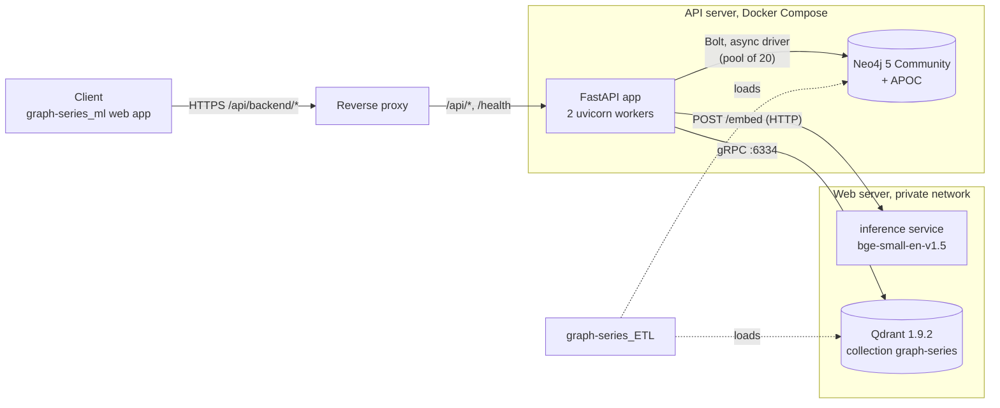
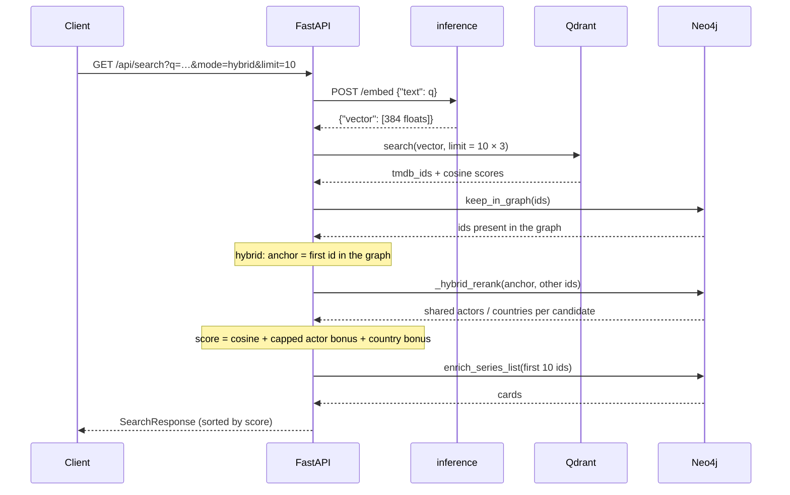
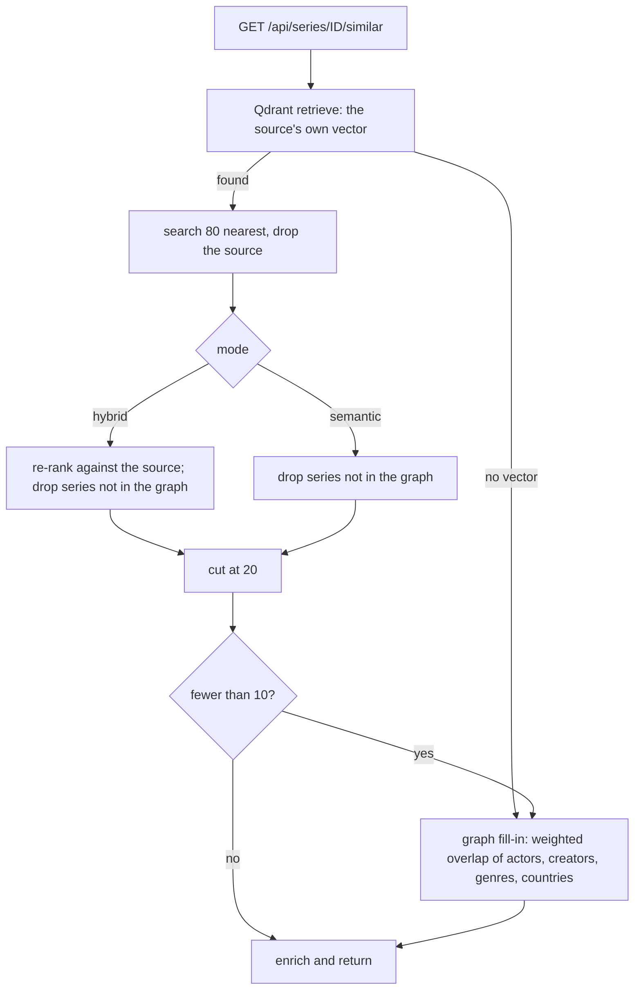
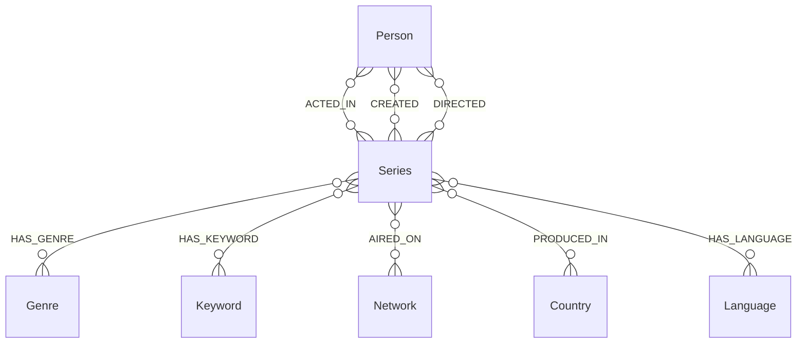

# Architecture

How the backend is built, how a request moves through it, and what it stores. The reasoning behind the choices is in [design-decisions.md](design-decisions.md); the endpoints are in [api.md](api.md).

## Components



| Component | Where it runs | Role |
|---|---|---|
| FastAPI app | API server container, 2 uvicorn workers | the only public-facing process of this repository |
| Neo4j 5 Community (+ APOC) | API server container | the graph: series, people, genres, keywords, networks, countries, languages |
| Qdrant 1.9.2 | web server (private network) | embeddings of every series with a description; gRPC only |
| inference service | web server (private network) | embeds queries with `BAAI/bge-small-en-v1.5` ([`graph-series_ml/inference`](https://github.com/GKatzer/graph-series_ml)) |
| reverse proxy | in front of the API | TLS, forwards the API paths; not part of this repository |

The API server has 4 GB of RAM, so it holds no model: embeddings come from the inference service over HTTP. Neo4j is configured with a 1 GB heap and 512 MB page cache (`docker-compose.yml`, `neo4j/conf/neo4j.conf`). The compose file publishes the Bolt port only on the private-network address of the host (variable `PRIVATE_BIND_IP`), not publicly; the FastAPI port is published on `127.0.0.1` and on that address.

## Code layout

```
fastapi/app/
├── main.py             app factory: CORS, lifespan (connectivity checks), routers under /api
├── config.py           pydantic-settings, reads .env and environment variables
├── schemas.py          GraphNode/GraphEdge/GraphData, node_id(), key property per label, blank_to_none()
├── db/neo4j.py         async driver singleton (pool 20, connect timeout 10 s)
├── db/qdrant.py        Qdrant client: sync client wrapped with run_in_executor; search, retrieve by id
├── services/
│   ├── embedder.py     POST to the inference service (10 s timeout)
│   ├── enricher.py     enrich_series_list(): one batch query for the result cards; keep_in_graph()
│   └── lucene.py       to_lucene_prefix_query(): escape user input, build an AND prefix query
└── routers/            health, search (+ similar), series, person, graph
```

At start-up (`lifespan`) the app verifies Neo4j and Qdrant connectivity and fails fast if either is down; on shutdown it closes the Neo4j driver. `/health/full` additionally runs `SHOW INDEXES` and requires `series_name_idx` and `person_name_idx` to be `ONLINE`. A failure of the embedding service is mapped to HTTP 503 by an exception handler in `main.py`.

## Request flows

### Semantic and hybrid search



The query-side instruction of the embedding model is added by the inference service, so the backend sends the raw query; documents in Qdrant were embedded without it.

### Similar series



### Structural search and autocomplete

The query goes through `to_lucene_prefix_query` (every special Lucene character is escaped; each word becomes `word*` and the words are joined with `AND`), then `CALL db.index.fulltext.queryNodes('series_name_idx', $q)`; the hits are ordered by exact title match, then score, then popularity. An input that is empty after trimming returns an empty result without touching Neo4j. The same helper is used for person search (`person_name_idx`) and `/api/series?name=`.

### Graph endpoints

All graph endpoints build their response from one or two Cypher queries and assemble `GraphData` in Python, de-duplicating nodes by their prefixed id. Edge patterns and labels come from constant dictionaries (`_SERIES_EDGES`, `_HUB_CONFIG`); user input only ever reaches Cypher as a parameter.

## Data model

The key of a series is its `tmdb_id` in every store: the Qdrant point id, the Neo4j node key and the ETL's parquet column.



| Label | Key property | Other properties |
|---|---|---|
| `Series` | `tmdb_id` (int) | `name`, `original_name`, `imdb_id`, `wikidata_id`, `tvdb_id`, `start_year`, `end_year`, `status`, `type`, `in_production`, `original_language`, `season_count`, `episode_count`, `episode_runtime`, `popularity`, `vote_average`, `vote_count`, `us_content_rating`, `overview`, `tagline`, `homepage`, `poster_path` |
| `Person` | `person_id` (int) | `name` |
| `Genre` | `genre_id` (int) | `name` |
| `Keyword` | `keyword_id` (int) | `name` (English tags) |
| `Network` | `network_id` (int) | `name`, `country` |
| `Country` | `code` (ISO 3166-1) | none |
| `Language` | `code` (ISO 639-1) | none; `HAS_LANGUAGE` lists **all** languages of a show, the original one is also in `Series.original_language` |

Empty cross-references are stored as `""`; the API returns them as `null` (`blank_to_none`).

### Schema (`scripts/schema_init.cypher`)

Idempotent (`IF NOT EXISTS`). Seven uniqueness constraints (one per label key), two full-text indexes and one range index:

```cypher
CREATE FULLTEXT INDEX series_name_idx IF NOT EXISTS FOR (s:Series) ON EACH [s.name, s.original_name];
CREATE FULLTEXT INDEX person_name_idx IF NOT EXISTS FOR (p:Person) ON EACH [p.name];
CREATE INDEX series_start_year IF NOT EXISTS FOR (s:Series) ON (s.start_year);
```

The title is indexed together with the original name so that a search for the English title finds a series whose stored name is localised. **The schema has to be applied again after every full wipe and reload of the graph**: the loader in `graph-series_ETL` does not create it, and the API depends on both full-text indexes. This was the cause of an incident on 2026-10-04 (see [Limitations](../README.md#limitations)).

### Qdrant collection

`graph-series`, 384 dimensions, cosine distance, point id = `tmdb_id`, payload `{tmdb_id, name, overview, imdb_id, start_year}`. Documents were embedded as `"{name}. {overview} Keywords: …"` without the BGE query instruction. The collection holds about 211,000 points (every series with a text), the graph about 56,000 (series with at least two votes by default; the ETL loader has options to change the threshold). The server is **1.9.2 and speaks gRPC only**, and the client is pinned to `qdrant-client==1.9.2` for that reason ([why](design-decisions.md#qdrant-client-pinned-to-the-server-version)).
